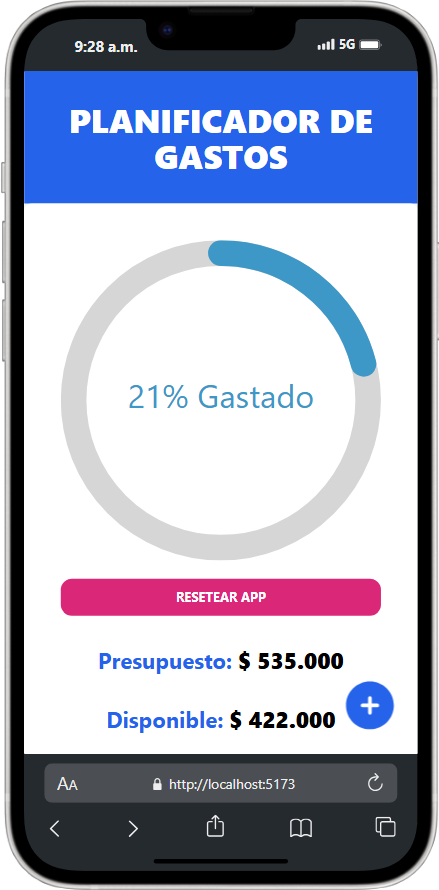

# 📊Expenses Control
  > A React and TypeScript application for managing personal expenses, built using Context API and styled with @nextui-org/react.

## 🚀 Features
- Add, edit, and delete expenses and incomes.
- Categorize spending for better insights.
- Responsive UI with NextUI components.
- State management with React Context API.

## 📸 Demo

.png>)

## 🔧 Tech Stack
- **Frontend:** React, TypeScript
- **Styling:** Tailwind CSS, @nextui-org/react
- **State Management:** Context API

## 📦 Installation

1. **Clone the repository:**

- git clone https://github.com/Sebastian14Vidales/expenses-control.git
- cd control-gastos-contextAPI

2. **Install dependencies:**

> npm install or yarn install

3. **Run the development server:**
> npm run dev or yarn dev

4. **Open in browser:**
Visit [http://localhost:3000/](http://localhost:3000/)

## 📂 Project Structure

###src/ 
###├── 📦 components/      # Reusable UI components
###├── 🗂️ context/         # Context API state management
###├── 🗃️ data/            # Static and dynamic data handling
###├── 🛠️ helpers/         # Utility helper functions
###├── 🛠️ hooks/           # Custom hooks
###└── 🔄 reducers/        # State reducers for Context API
###└── 📐 types/           # TypeScript type definitions

## 🤝 Contributing
1. Fork the repository.
2. Create a new branch (git checkout -b main).
3. Commit your changes (git commit -m 'Add new feature').
4. Push to the branch (git push origin main).
5. Open a Pull Request.
